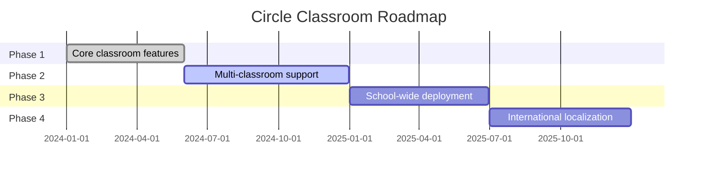

<!--
  ██████╗ ██╗███╗   ██╗██╗ ██████╗██╗     ██████╗ 
 ██╔═══██╗██║████╗  ██║██║██╔════╝██║     ██╔══██╗
 ██║   ██║██║██╔██╗ ██║██║██║     ██║     ██║  ██║
 ██║   ██║██║██║╚██╗██║██║██║     ██║     ██║  ██║
 ╚██████╔╝██║██║ ╚████║██║╚██████╗███████╗██████╔╝
  ╚═════╝ ╚═╝╚═╝  ╚═══╝╚═╝ ╚═════╝╚══════╝╚═════╝ 
-->
<h1 align="center">
  🎬✨ <span style="color: #3b82f6">Circle Classroom</span> – <em>Smart Classroom Management</em> ✨🎬
</h1>

<p align="center">
  
  
  
  
</p>

---

<p align="center">
  <b><i>“Education shouldn't be limited by borders or bureaucracy.<br>
  <span style="color: #06b6d4;">Circle Classroom</span> — connecting classrooms worldwide.”</i></b>
</p>

---

## 🌠 Cinematic Opening Scene

> <details>
> <summary><b>Imagine...</b> <i>(click to expand)</i></summary>
> <blockquote>
> A teacher enters a buzzing classroom.<br>
> With a single tap, attendance is done.<br>
> Emergency cards are ready.<br>
> All student info <b>at their fingertips</b>.<br>
> <br>
> <b>This is <span style="color: #3b82f6;">Circle Classroom</span> — your digital assistant for modern education.</b>
> </blockquote>
> </details>

---

## 🌟 About The Project

**Circle Classroom** is a powerful yet simple classroom management system, part of the **Circle Project** by **ACO Team**.  
🎥 Designed to save teachers **1+ hour daily** on admin tasks, while providing **emergency-ready student info**—all at a click.

---

## ✨ Why Circle Classroom?

- ⚡ **One-Click Attendance** – Fastest present/absent toggle ever
- 📱 **QR Student Cards** – Printable, scannable emergency IDs
- 🎯 **Zero Learning Curve** – Teachers master it in minutes
- 🌍 **Global Vision** – Built by an international team

---

## 🚀 Features: The Director’s Cut

| ⭐ Feature              | 🎬 Description                                                                 |
|------------------------|-------------------------------------------------------------------------------|
| Teacher Authentication | Secure login & registration                                                   |
| Student Management     | Rich profiles: photos, contacts, medical info                                 |
| Smart Attendance       | One-tap present/absent toggle                                                 |
| QR Generator           | Print student ID cards with scannable emergency data                          |
| Reports & Export       | PDF/Excel reports and data export                                             |
| Mobile Responsive      | Works seamlessly on any device                                                |

---

## 🧑‍🏫 Teacher Workflow (Your Script)

1. 🎬 **Add Students** → Digital profiles with emergency data  
2. 🖨️ **Generate QR Cards** → Print emergency ID cards  
3. ✅ **Daily Attendance** → One-click toggles  
4. 📤 **Export Reports** → Attendance + rosters  

---

## 🛠️ Tech Stack (Behind the Scenes)

- **Frontend:** React.js, Tailwind CSS  
- **Backend:** Node.js/Express  
- **Database:** MongoDB  
- **QR Generation:** QRCode.js  
- **Authentication:** JWT  
- **Deployment:** Vercel / Netlify  

---

## 💻 Quick Start (Lights, Camera, Action!)

```bash
# 1. 🎬 Clone the repo
git clone https://github.com/aco-team/circle-classroom.git

# 2. 🎥 Install dependencies
npm install

# 3. 🚀 Start developing
npm run dev

# 4. 🏗️ Build for production
npm run build
```
---

## 🎬 Meet the Cast

| Role                | Name / Handle         |
|---------------------|----------------------|
| Director (Lead Dev) | Nikil Nikesh (Splash Pro) |
| Producer            | ACO Team - Global Innovation Collective |
| UI Advisors         | Muditha Maduranga, Evelyn Lising |
| International Crew  | China, India, Sri Lanka, South Africa |
| Special Thanks      | Friends & Contributors worldwide |

---

## 🌍 Circle Project Vision

Part of a larger initiative by ACO Team to create interconnected, practical solutions for education systems worldwide.

**Project Branches:**
- 🏫 Circle Classroom _(Current)_
- 📚 Circle Library _(Planning)_
- 👨‍👩‍👧‍👦 Circle Parents _(Future)_
- 🏢 Circle School _(Future)_

---

## 🎞️ Project Roadmap



---

## 🤝 Contributing

We welcome global contributors!  
ACO Team believes in **collaborative innovation**.

1. 🍴 Fork the repository
2. 🌱 Create a feature branch (`git checkout -b feature/innovation`)
3. 💾 Commit changes (`git commit -m 'Add amazing feature'`)
4. 🚀 Push to branch (`git push origin feature/innovation`)
5. 🔥 Open a Pull Request

---

## 📄 License

Distributed under the **MIT License**.  
See [LICENSE](LICENSE) for more.

---

## 🌐 Connect With ACO

- 🌍 Website: _Coming Soon_
- 📧 Email: aco-team@example.com
- 🏢 Global HQ: Multiple continents

---

## 🙏 Acknowledgments

- Thanks to educators worldwide for testing and feedback
- All ACO Team members across China, India, Sri Lanka, South Africa
- Global friends supporting educational innovation
- The open-source community

---

<p align="center">
  ⭐ <b>Star us if you believe in global educational innovation!</b> ⭐
</p>

---

<p align="center">
  
</p>
---

⭐ Star us if you believe in global educational innovation!

---

"Education shouldn't be limited by borders or bureaucracy. Circle Classroom - connecting classrooms worldwide." 🌍

Part of the Circle Project by ACO Team - Building the future, together.
